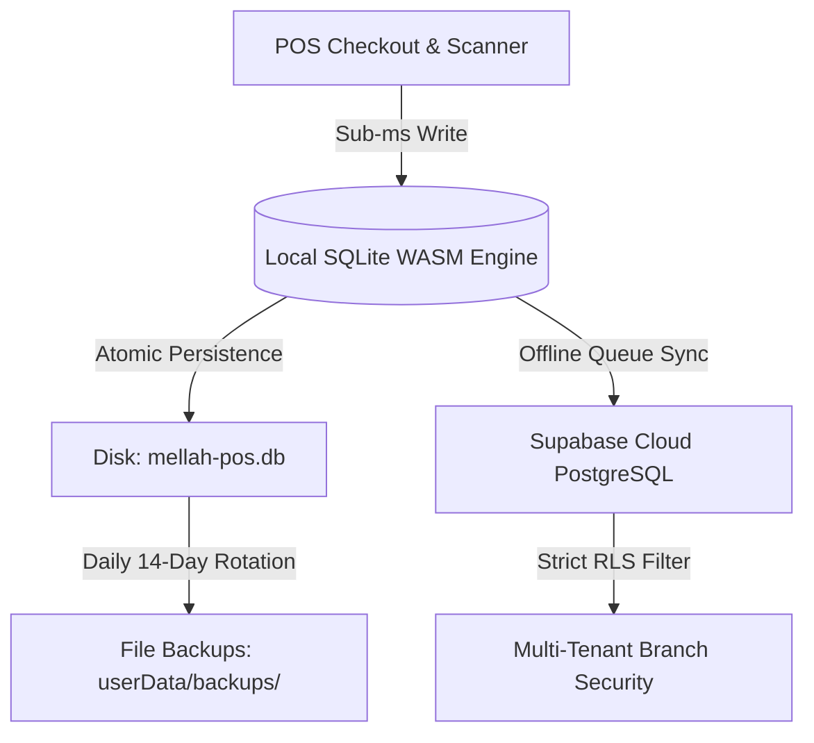
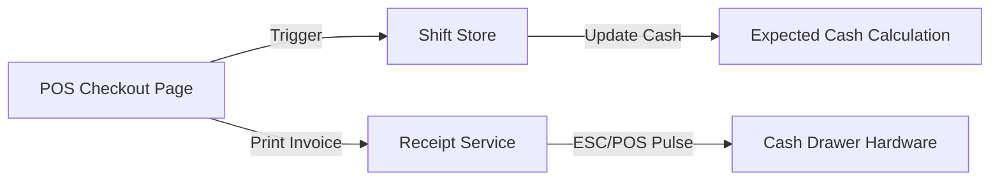

# 🛍️ MELLAH POS V2 — Enterprise Retail Point of Sale & ERP Engine
### *برنامج الملاح المتقدم v1.0.1 — الحل التجاري المتكامل لإدارة المبيعات، الستوك، الديون، والورديات بالجزائر*

[](https://github.com/userkxm00/Mellah-POS-V2/releases)
[](https://www.electronjs.org/)
[](https://react.dev/)
[](https://www.typescriptlang.org/)
[](https://sqlite.org/)
[](https://supabase.com/)
[](https://github.com/Graphify-Labs/graphify)
[](https://github.com/userkxm00/Mellah-POS-V2)

---

## 🌐 Language Selector / اختيار اللغة
- [🇬🇧 English Enterprise Manual](#-english-enterprise-manual)
- [🇩🇿 الدليل العربي الاحترافي الشامل](#-الدليل-العربي-الاحترافي-الشامل)

---

# 🇬🇧 English Enterprise Manual

## 📑 Table of Contents (English)
1. [Executive Summary & Core Philosophy](#1-executive-summary--core-philosophy)
2. [Full System Architecture & Graphify Knowledge Index](#2-full-system-architecture--graphify-knowledge-index)
3. [Deep Module & Workflow Breakdown](#3-deep-module--workflow-breakdown)
4. [IPC API Bridge Specification](#4-ipc-api-bridge-specification)
5. [Security, Auth & Row-Level Security (RLS) Blueprint](#5-security-auth--row-level-security-rls-blueprint)
6. [Durable File-Based Auto-Backup Engine](#6-durable-file-based-auto-backup-engine)
7. [Complete Database Schema Reference (18 Tables)](#7-complete-database-schema-reference-18-tables)
8. [Hardware & POS Peripheral Integration](#8-hardware--pos-peripheral-integration)
9. [Mathematical & Accounting Formulas](#9-mathematical--accounting-formulas)
10. [Test Suite, Verification & CI/CD Release Guide](#10-test-suite-verification--cicd-release-guide)

---

## 1. Executive Summary & Core Philosophy

**MELLAH POS V2** is an enterprise-grade, **offline-first**, multi-branch Point of Sale (POS) and inventory management software engineered specifically for the Algerian retail market (clothing boutiques, shoes, electronics, cosmetics, and general trade). 

Built with **Electron 31, React 18, WASM SQLite (`sql.js`), and Supabase (PostgreSQL 15)**, it delivers sub-millisecond local checkout speeds while guaranteeing full cloud synchronization and strict multi-tenant branch security.



---

## 2. Full System Architecture & Graphify Knowledge Index

The repository codebase is fully mapped into a persistent **Graphify Knowledge Graph** containing **657 nodes and 1,291 dependency edges**.

### Architectural Hubs (God Nodes):
- `useToastStore` — Global feedback notification state (52 edges).
- `generateUUID()` — System-wide immutable primary key generator (31 edges).
- `useLanguageStore` — Real-time i18n translation engine (Arabic/French/English) (23 edges).
- `formatCurrency()` — DZD currency formatting with Algerian Dinars symbol (21 edges).
- `recordAuditLog()` — Security activity auditing service (17 edges).

---

## 3. Deep Module & Workflow Breakdown

### 🛒 1. POS Checkout Module (`POSCheckoutPage.tsx`)
- **Fast Cart Operations**: Instant barcode scanner listener (`keydown`), live search by name, SKU, or barcode.
- **Multi-Variant Product Selector**: Interactive modal (`VariantMatrixModal.tsx`) for selecting size (S, M, L, XL, XXL) and color combinations.
- **Flexible Payment Methods**: Cash (`cash`), Customer Credit Debt (`credit`), or Mixed Payment (`mixed`).
- **Keyboard Shortcuts**:
  | Hotkey | Action | Description |
  |---|---|---|
  | `F2` | Checkout | Opens payment dialog & completes transaction |
  | `F4` | Open Cash Drawer | Sends ESC/POS pulse signal with warning toast fallback |
  | `ESC` | Clear / Close | Clears active cart draft or closes open modals |

### 💰 2. Cash Shift Reconciliation (`ShiftsPage.tsx` & `shiftStore.ts`)
- **Shift Opening**: Cashiers enter starting cash balance (`initial_cash_dzd`).
- **Real-Time Cash Tracking**: Includes cash sales + **customer cash debt repayments** made during the shift.
- **Shift Closing Audit**: Compares actual physical cash counted against system expected cash.
- **Reconciliation Summary**: Displays exact surplus or shortage (`actual_cash - expected_cash`) with mandatory cashier closing notes.

### 📑 3. Customer & Debt Management (`CustomersPage.tsx`)
- **Customer Directory**: Full profile tracking (Name, Phone, Address, Credit Limit).
- **Double-Entry Debt Ledger (`customer_payments`)**: Tracks debt payments separately from individual sales.
- **Debt Balance Computation**:
  $$\text{Total Remaining Debt} = \sum (\text{Sale Remaining Debt}) - \sum (\text{Customer Debt Payments})$$

### 🚛 4. Supplier & Purchase Ledger (`SuppliersPage.tsx`)
- **Vendor Directory**: Wholesaler contact directory and balance sheet.
- **Purchase Orders (`supplier_purchases`)**: Invoice logging for stock restocks.
- **Supplier Payment Ledger (`supplier_payments`)**: Record settlement payments to suppliers.

---

## 4. IPC API Bridge Specification

The renderer communicates safely with the main process via typed context bridge (`src/preload/index.ts`):

```ts
export interface ElectronApi {
  db: {
    query: <T>(sql: string, params?: unknown[]) => Promise<T[]>
    execute: (sql: string, params?: unknown[]) => Promise<DbRunResult>
    transaction: (ops: Array<{ sql: string; params: unknown[] }>) => Promise<DbRunResult[]>
  }
  backup: {
    runAuto: () => Promise<BackupResult>
    getInfo: () => Promise<BackupInfo>
    getDir: () => Promise<string>
    setDir: (customDir: string | null) => Promise<BackupSetDirResult>
    pickFolder: () => Promise<BackupPickFolderResult>
  }
  printer: {
    getPrinters: () => Promise<PrinterInfo[]>
    printHtml: (html: string, printerName?: string) => Promise<boolean>
    openCashDrawer: (printerName?: string) => Promise<boolean>
  }
}
```

---

## 5. Security, Auth & Row-Level Security (RLS) Blueprint

Every table in Supabase enforces strict **Fail-Closed Row-Level Security**. Unauthenticated requests or queries without a valid session token automatically return empty result sets (`[]`).

### SQL Helper Functions (`database/supabase_setup.sql`):
```sql
CREATE OR REPLACE FUNCTION current_user_branch_id()
RETURNS UUID AS $$
  SELECT branch_id FROM public.users WHERE id = auth.uid();
$$ LANGUAGE sql STABLE SECURITY DEFINER;

CREATE OR REPLACE FUNCTION is_admin()
RETURNS BOOLEAN AS $$
  SELECT EXISTS (
    SELECT 1 FROM public.users 
    WHERE id = auth.uid() AND role IN ('admin', 'super_admin')
  );
$$ LANGUAGE sql STABLE SECURITY DEFINER;
```

---

## 6. Durable File-Based Auto-Backup Engine

- **Storage Location**: Real JSON snapshot files stored in `{userData}/backups/`.
- **Filename Convention**: `mellah-pos-backup-YYYY-MM-DDTHH-mm-ss.json`.
- **Rolling Retention**: Maximum **14 daily backups** kept. Older backups purged automatically.
- **Custom Location Picker**: User can configure external USB / cloud folder in `backup-config.json`.
- **Fallback Transparency**: If external USB is unplugged, system falls back to default directory and displays alert banner in Settings.

---

## 7. Complete Database Schema Reference (18 Tables)

1. `branches` — Branch store locations & metadata.
2. `users` — Cashiers, managers, admins with salted PIN hashes.
3. `categories` — Product categories with hierarchical grouping.
4. `products` — Base product catalog (names, barcodes, base prices).
5. `product_variants` — SKU variants (`product_id`, `size`, `color`, `sku`, `stock_quantity`, `purchase_price_dzd`, `selling_price_dzd`).
6. `stock_movements` — Stock audit log (purchases, sales, manual adjustments).
7. `shifts` — Work shifts with cash reconciliation totals.
8. `sales` — Sale receipts (cash, credit, mixed payments).
9. `sale_items` — Line items contained within each sale.
10. `returns` — Customer product return logs with inventory restock.
11. `customers` — Customer profile records and contact details.
12. `customer_payments` — Customer debt repayment history ledger.
13. `suppliers` — Vendor & wholesaler directory.
14. `supplier_purchases` — Supplier stock purchase invoices.
15. `supplier_payments` — Supplier debt settlement ledger.
16. `store_settings` — Receipt headers, thermal paper width, timeout limits.
17. `audit_logs` — Activity logging for security compliance.
18. `backup_config` — Custom auto-backup path preferences.

---

## 8. Hardware & POS Peripheral Integration

### Cash Drawer ESC/POS Pulse Command:
```ts
// ESC/POS Cash Drawer Pulse Signal
const htmlPulse = `<!DOCTYPE html><html><head><style>@page{size:80mm 10mm;margin:0;}body{margin:0;font-size:1px;}</style></head><body>&#27;&#112;&#0;&#25;&#250;</body></html>`
```

---

## 9. Mathematical & Accounting Formulas

$$\text{Net Total} = \sum (\text{Unit Price} \times \text{Quantity}) - \text{Discount}$$

$$\text{Expected Cash} = \text{Initial Cash} + \text{Cash Sales} + \text{Customer Cash Debt Payments} - \text{Returns}$$

$$\text{Shift Difference} = \text{Actual Cash Counted} - \text{Expected Cash}$$

---

## 10. Test Suite, Verification & CI/CD Release Guide

```bash
# Run Full Test Suite (10 test files, 37 unit tests passing)
pnpm test

# Run TypeScript Typecheck & ESLint
pnpm typecheck
pnpm lint

# Production Desktop Build for Windows
pnpm build:win

# Build & Publish Release to GitHub Releases
pnpm release
```

---
<br/>
<hr/>
<br/>

# 🇩🇿 الدليل العربي الاحترافي الشامل

# 🛍️ MELLAH POS V2 — النظام التجاري والتنفيذي المتقدم لإدارة المحلات بالجزائر

**Mellah POS V2** هو نظام نقطة بيع (POS) وإدارة مخزون تجاري متكامل، يعمل بمبدأ **العمل المحلي المستقل 100% بدون إنترنت (Offline-First)**، مخصص خصيصاً للمحلات والأنشطة التجارية في الجزائر (بوتيكات الملابس والأحذية، المواد الغذائية، المستحضرات، والأجهزة). تم بناؤه بأحدث تقنيات **Electron 31, React 18, WASM SQLite, Supabase** لتقديم سرعة فائقة مع أمان مطلق واستقرار تنيفيذي تام.

---

## 📑 فهرس المحتويات (بالعربية)
1. [الملخص التنفيذي والرؤية](#1-الملخص-التنفيذي-والرؤية)
2. [المخطط الهيكلي وخريطة المعرفة Graphify](#2-المخطط-الهيكلي-وخريطة-المعرفة-graphify)
3. [الشرح التفصيلي لوحدات التطبيق](#3-الشرح-التفصيلي-لوحدات-التطبيق)
4. [واجهة البرمجة IPC API Bridge](#4-واجهة-البرمجة-ipc-api-bridge)
5. [مخطط الأمان وسياسات RLS الصارمة](#5-مخطط-الأمان-وسياسات-rls-الصارمة)
6. [نظام النسخ الاحتياطي التلقائي على القرص](#6-نظام-النسخ-الاحتياطي-التلقائي-على-القرص)
7. [المرجع الكامل لجداول قاعدة البيانات (18 جدولاً)](#7-المرجع-الكامل-لجداول-قاعدة-البيانات-18-جدولاً)
8. [الربط مع الطابعات الحرارية ودرج المال](#8-الربط-مع-الطابعات-الحرارية-ودرج-المال)
9. [المعادلات المحاسبية والمالية](#9-المعادلات-المحاسبية-والمالية)
10. [دليل التشغيل والاختبارات للمطورين](#10-دليل-التشغيل-والاختبارات-للمطورين)

---

## 1. الملخص التنفيذي والرؤية

تم تطوير **Mellah POS V2** ليكون الحل التجاري النهائي للمحلات، حيث يضمن:
- **استمرارية البيع 100% بدون إنترنت**: لا يتوقف المحل إطلاقاً عند انقطاع الشبكة أو التغطية.
- **أمان وموثوقية البيانات**: فصل تام لبيانات الفروع ومنع أي تسريب بين المستخدمين.
- **شفافية الصندوق والمحاسبة**: احتساب دقيق لكاش الوردية بما فيه تسديدات ديون الزبائن النقدية.
- **حماية البيانات من الضياع**: نظام نسخ احتياطي تلقائي يكتب ملفات JSON على القرص أو الفلاشة الخارجية بـ 14 يوم تدوير.

---

## 2. المخطط الهيكلي وخريطة المعرفة Graphify

تم فحص وفهرسة كامل المشروع في خريطة معرفية تضمن **657 عقدة برمجية و 1,291 رابطة معمارية**:



---

## 3. الشرح التفصيلي لوحدات التطبيق

### 🛒 1. واجهة البيع السريع (`POSCheckoutPage.tsx`)
- **دعم قارئ البار كود**: التقاط فوري لرمز البار كود عبر الـ Scanner.
- **اختيار المتغيرات (Size/Color Matrix)**: نافذة سريعة لاختيار المقاس (S, M, L, XL, XXL) واللون.
- **طرق الدفع المتعددة**: كاش (`cash`)، بيع بالكريدي (`credit`)، أو دفع مشترك (`mixed`).
- **اختصارات الكيبورد السريعة**:
  - `F2`: إتمام الفاتورة فوراً.
  - `F4`: إرسال نبضة فتح درج المال مع إشعار توست.
  - `ESC`: إلغاء الفاتورة الحالية أو إغلاق النوافذ.

### 💰 2. إدارة الورديات والصندوق (`ShiftsPage.tsx` & `shiftStore.ts`)
- **فتح الوردية**: إدخال الكاش الأولي للصندوق (`initial_cash_dzd`).
- **متابعة التدفق النقدي**: احتساب مبيعات الكاش + **تسديد ديون الزبائن بالكاش خلال الوردية**.
- **مطابقة الشيفت**: مقارنة الكاش الفعلي المحسوب في اليد مع الكاش المتوقع في النظام عند القفل.
- **احتساب الفارق**: إظهار الفائض أو العجز (`actual_cash - expected_cash`) مع تسجيل ملاحظات البائع.

### 📑 3. دليل الزبائن والديون (`CustomersPage.tsx`)
- **سجل الزبائن**: متابعة ديون كل زبون وسقف الكريدي المسموح.
- **دفتر تسديد الديون (`customer_payments`)**: تسجيل دفعات الديون بشكل مستقل عن فواتير البيع.
- **حساب صافي الدين**:
  $$\text{إجمالي الدين المتبقي} = \sum (\text{ديون الفواتير}) - \sum (\text{دفتر تسديدات الزبون})$$

### 🚛 4. الموردين والمشتريات (`SuppliersPage.tsx`)
- **دليل الموردين**: سجل الموزعين وتجار الجملة.
- **فواتير الشراء (`supplier_purchases`)**: تسجيل فواتير السلعة الجديدة وتحديث الستوك.
- **دفتر تسديدات الموردين (`supplier_payments`)**: تسجيل الدفعات الصادرة للموردين.

---

## 4. واجهة البرمجة IPC API Bridge

يتم التواضل بين واجهة المستخدم والـ Main Process عبر قناة آمنة ومحددة الأنواع (`src/preload/index.ts`):

- `electron.db.query(sql, params)`
- `electron.db.execute(sql, params)`
- `electron.db.transaction(operations)`
- `electron.backup.runAuto()`
- `electron.backup.getInfo()`
- `electron.backup.setDir(customDir)`
- `electron.printer.openCashDrawer(printerName)`

---

## 5. مخطط الأمان وسياسات RLS الصارمة

جميع الجداول محمية بـ **Fail-Closed Row-Level Security** عبر دالتين أمنيتين:
```sql
CREATE OR REPLACE FUNCTION current_user_branch_id()
RETURNS UUID AS $$
  SELECT branch_id FROM public.users WHERE id = auth.uid();
$$ LANGUAGE sql STABLE SECURITY DEFINER;
```

---

## 6. نظام النسخ الاحتياطي التلقائي على القرص

- **المسار**: ملفات JSON حقيقية تحفظ في `{userData}/backups/`.
- **التدوير التلقائي**: الاحتفاظ بآخر **14 نسخة يومية** وحذف الأقدم آلياً.
- **تخصيص المسار الخارجي**: إمكانية اختيار فلاشة USB أو مجلد Google Drive / OneDrive مع إظهار تنبيه برتقالي في الإعدادات في حال فصل الفلاشة.

---

## 7. المرجع الكامل لجداول قاعدة البيانات (18 جدولاً)

1. `branches` — بيانات الفروع والمحلات.
2. `users` — المستخدمين والباعة وتشفير PIN.
3. `categories` — تصنيفات السلع.
4. `products` — قوالب المنتجات.
5. `product_variants` — مقاسات وألوان والبار كود والستوك.
6. `stock_movements` — سجل حركة المستودع والستوك.
7. `shifts` — الورديات وجلسات العمل.
8. `sales` — فواتير البيع والكاش والكريدي.
9. `sale_items` — تفاصيل الفاتورة.
10. `returns` — المرجعات واسترجاع المخزون.
11. `customers` — دليل الزبائن.
12. `customer_payments` — دفتر تسديد ديون الزبائن.
13. `suppliers` — دليل تجار الجملة.
14. `supplier_purchases` — فواتير الشراء والسلعة.
15. `supplier_payments` — تسديدات الموردين.
16. `store_settings` — إعدادات الفاتورة واللغة.
17. `audit_logs` — سجل عمليات الأمان والتغييرات.
18. `backup_config` — مسار الباكاب الخارجي.

---

## 8. الربط مع الطابعات الحرارية ودرج المال

نبضة فتح درج المال آلياً عند البيع أو عند زر `F4`:
```html
&#27;&#112;&#0;&#25;&#250;
```

---

## 9. المعادلات المحاسبية والمالية

$$\text{إجمالي الفاتورة} = \sum (\text{سعر الوحدة} \times \text{الكمية}) - \text{الخصم}$$

$$\text{الكاش المتوقع بالصندوق} = \text{الكاش الأولي} + \text{مبيعات الكاش} + \text{تسديدات ديون الزبائن بالكاش} - \text{المرجعات}$$

$$\text{فارق الوردية} = \text{الكاش الفعلي المحسوب} - \text{الكاش المتوقع}$$

---

## 10. دليل التشغيل والاختبارات للمطورين

```bash
# تشغيل كامل الفحوصات والاختبارات (10 ملفات اختبار و 37 وحدة ناجحة)
pnpm test

# فحص أنواع TypeScript و ESLint
pnpm typecheck
pnpm lint

# بناء الملف التنفيذي للويندوز
pnpm build:win
```

---

 حقوق الطبع والنشر © **فريق الملاح التجاري Mellah POS Team** — مخصص ومطور لمحلات الجزائر.
