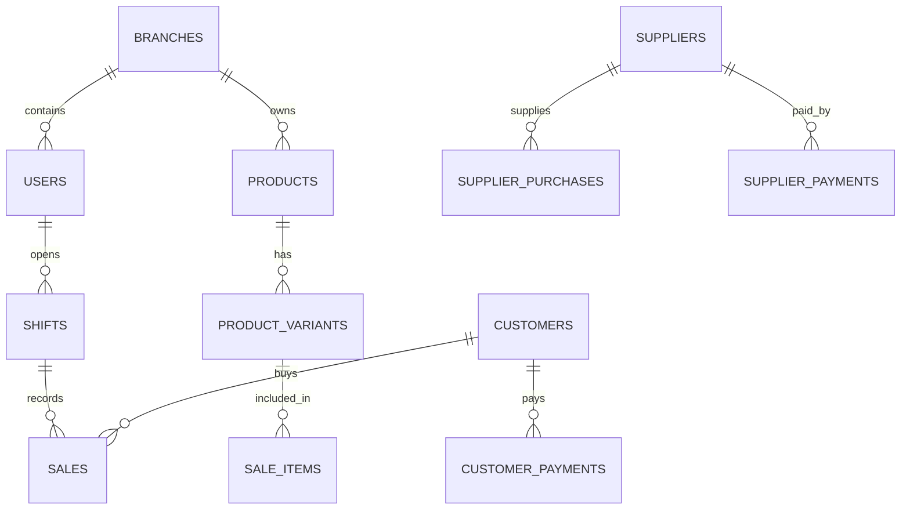

# 🛍️ MELLAH POS V2 — Professional Retail Point of Sale System
### *برنامج الملاح لإدارة المبيعات والمخزون والديون — المخصص للمحلات والأنشطة التجارية في الجزائر*


---

## 🌐 Language Selector / اختيار اللغة
- [🇬🇧 English Documentation](#-english-documentation)
- [🇩🇿 النسخة العربية المحترفة](#-النسخة-العربية-المحترفة)

---

# 🇬🇧 English Documentation

## 📌 Executive Summary

**MELLAH POS V2** is an enterprise-grade, **offline-first**, commercial Point-of-Sale (POS) and Store Management solution designed specifically for Algerian retail boutiques, clothing stores, and general merchants. Built with **Electron, React 18, WASM SQLite, and Supabase**, it delivers sub-millisecond local checkout speeds while guaranteeing full cloud synchronization and strict multi-tenant branch security.

---

## ⚡ Key Highlights & Architecture

### 1. 🌐 Offline-First Architecture & WASM SQLite Engine
- **Zero Internet Dependency for POS**: Checkout, inventory lookups, customer debts, and shift closures run 100% locally.
- **Transactional Consistency**: Powered by SQLite WASM with atomic `withTransaction` isolation to prevent corruption during unexpected power outages.
- **Automatic Persistence**: Changes are automatically written to disk asynchronously (`mellah-pos.db`).

### 2. 🛡️ Enterprise Security & Fail-Closed RLS
- **Multi-Tenant Branch Isolation**: Data is automatically partitioned by `branch_id`.
- **Fail-Closed Policy Enforcement**: All **18 database tables** are protected by strict PostgreSQL Row-Level Security (RLS) via Supabase policies using `current_user_branch_id()` and `is_admin()`. Unauthenticated access yields zero records (`[]`).
- **Production Hardening**: Electron DevTools are restricted to development builds, and the default system menu bar is disabled for non-admin kiosk mode.
- **PIN Verification**: Employee authentication uses salted `bcryptjs` hashing.

### 3. 💾 Durable File-Based Backup System
- **Real File Persistence**: Backups are generated as physical JSON snapshot files via Node.js `fs` in the Main Process.
- **Automated Daily Schedule & 14-Day Rotation**: Keeps the last 14 daily backups, automatically purging older files.
- **External Folder Configuration**: Users can select custom backup locations (USB drives, external SSDs, or Google Drive / OneDrive desktop sync folders).
- **Smart Fallback Transparency**: If an external USB drive is disconnected, the system safely falls back to local storage and displays an explicit status alert banner in Settings.

### 4. 📊 Financial Reconciliation & Cash Shift Operations
- **Shift Management**: Full shift lifecycle (Opening balance, POS cash sales, customer debt repayments in cash, cash drawer reconciliation).
- **Expected Cash Formula**:
  $$\text{Expected Cash} = \text{Initial Cash} + \text{Cash Sales} + \text{Customer Cash Debt Payments} - \text{Returns}$$
- **Discrepancy Auditing**: Real-time calculation of surplus or shortage (`actual_cash - expected_cash`).

### 5. 💳 Double-Entry Debt & Credit Ledgers
- **Customers Debt Ledger (`customer_payments`)**: Tracks partial payments, credit sales, and remaining debt history per customer.
- **Suppliers Purchase & Credit Ledger (`supplier_payments` & `supplier_purchases`)**: Manages supplier stock acquisitions, payments, and payable balances.

### 6. 🖨️ Hardware & Thermal Receipt Printing
- **ESC/POS Native Pulse Integration**: Controls hardware cash drawers (via ESC/POS pulse `0x1B 0x70`).
- **Thermal Receipt Generation**: Supports 80mm & 58mm thermal printers with custom store logos, footers, and barcode integration (`JsBarcode` / `@resvg/resvg-js`).
- **Keyboard Shortcuts**: Built-in hotkeys (`F2` Checkout, `F4` Open Drawer, `ESC` Cancel).

---

## 🛠️ Technology Stack

| Domain | Technology | Description |
|---|---|---|
| **Desktop Framework** | Electron 31 + Electron Vite | High-performance cross-platform desktop wrapper |
| **Frontend Framework** | React 18 + TypeScript 5.5 | Type-safe UI component architecture |
| **Styling** | Vanilla CSS + TailwindCSS | Modern dark/light glassmorphic styling system |
| **Local Database** | WASM SQLite (`sql.js`) | In-memory relational engine with file persistence |
| **Cloud Backend** | Supabase (PostgreSQL 15) | Real-time cloud sync engine with strict RLS |
| **State Management** | Zustand 4 | Lightweight reactive state stores |
| **Packaging & Updates**| `electron-builder` + `electron-updater` | Automated NSIS installers & GitHub Releases updates |

---

## 🗄️ Database Schema (18 Tables)



1. `branches` — Branch store locations & metadata.
2. `users` — Cashiers, managers, admins with salted PIN hashes.
3. `categories` — Product categories with hierarchical grouping.
4. `products` — Base product catalog (names, barcodes, base prices).
5. `product_variants` — Specific SKU matrix (size, color, barcode, stock quantity).
6. `stock_movements` — Stock audit log (purchases, sales, manual adjustments).
7. `shifts` — Cashier work shifts with cash reconciliation totals.
8. `sales` — Sale transaction receipts (cash, credit, mixed payments).
9. `sale_items` — Line items contained within each sale.
10. `returns` — Customer product return logs with inventory restock.
11. `customers` — Customer profile records and contact details.
12. `customer_payments` — Customer debt repayment history ledger.
13. `suppliers` — Vendor & wholesaler directory.
14. `supplier_purchases` — Supplier stock purchase invoices.
15. `supplier_payments` — Supplier debt settlement ledger.
16. `store_settings` — Receipt headers, thermal paper width, timeout limits.
17. `audit_logs` — Activity logging for security compliance.
18. `backup_config` — Custom auto-backup path preferences.

---

## 🚀 Getting Started for Developers

### Prerequisites
- Node.js >= 18.0.0
- pnpm >= 9.0.0

### Installation & Run

```bash
# Clone repository
git clone https://github.com/userkxm00/Mellah-POS-V2.git
cd "mellah pos"

# Install dependencies
pnpm install

# Run in Development Mode
pnpm dev

# Execute Typecheck, Linter & Unit Test Suite
pnpm typecheck
pnpm lint
pnpm test
```

### Production Build & Packaging

```bash
# Build desktop application for Windows
pnpm build:win

# Build & Publish Release to GitHub Releases
pnpm release
```

---

<br/>
<hr/>
<br/>

# 🇩🇿 النسخة العربية المحترفة

# 🛍️ MELLAH POS V2 — النظام التجاري المتقدم لإدارة المحلات والأنشطة التجارية

**Mellah POS V2** هو نظام نقطة بيع (POS) تجاري احترافي، يعتمد على مبدأ **العمل الكامل بدون إنترنت (Offline-First)**، مخصص خصيصاً للمحلات والأنشطة التجارية بالجزائر (بوتيكات الملابس، المحلات التجارية، والموزعين). تم بناء التطبيق باستخدام أحدث التقنيات **Electron, React 18, WASM SQLite, Supabase** لتقديم سرعة فائقة مع أمان مطلق واستقرار تنيفيذي تام.

---

## 🌟 أبرز المميزات المعمارية للنظام

### 1. ⚡ نظام محلي يعمل 100% بدون إنترنت (WASM SQLite)
- **استقلالية تامة عن الشبكة**: كل عمليات البيع، الستوك، قفل الشيفتات، وتسديد ديون الزبائن تتم محلياً بسرعة أجزاء من الثانية.
- **حماية البيانات من الانقطاع المفاجئ**: معالجة معاملات قاعدة البيانات عبر `withTransaction` لضمان عدم تلف البيانات عند انقطاع الكهرباء.
- **حفظ تلقائي مستمر**: تُحفظ التغييرات تلقائياً في ملف القرص الصلب المحالي `mellah-pos.db`.

### 2. 🛡️ نظام أمني مغلق وصارم (Fail-Closed RLS)
- **عزل بيانات الفروع**: فصل تلقائي لبيانات كل فرع تجاري على حدة.
- **سياسات RLS على جميع الجداول ה-18**: حماية كل جداول قاعدة البيانات بـ PostgreSQL Row-Level Security عبر Supabase. المحاولات غير المصرحة ترجع نتيجة فارغة فوراً (`[]`).
- **حماية بيئة الإنتاج**: حظر أدوات DevTools في النسخة التجارية، وإخفاء شريط القوائم العلوي للتطبيق.
- **تشفير رمز PIN**: تشفير رموز الدخول للعمال والمدراء باستخدام `bcryptjs`.

### 3. 💾 نظام النسخ الاحتياطي التلقائي الحقيقي (File-Based Auto-Backup)
- **نسخ احتياطي على نظام الملفات الحقيقي**: يتم إنشاء ملفات JSON حقيقية على القرص في مجلد `{userData}/backups/`.
- **تدوير تلقائي لمدة 14 يوماً**: يحتفظ النظام بأحدث 14 نسخة يومية ويحذف النسخ القديمة تلقائياً.
- **تخصيص مجلد الباكاب الخارجي**: يمكن للمستخدم توجيه النسخ لمجلد خارجي (فلاشة USB، قرص خارجي، أو مجلد Google Drive / OneDrive).
- **كشف انقطاع المجلد الخارجي**: في حال فصل القرص الخارجي، يرجع النظام تلقائياً للباكاب المحلي مع عرض تنبيه برتقالي واضح في الإعدادات.

### 4. 💰 إدارة الوردية (Shift Management) والمحاسبة الدقيقة
- **دورة حياة الشيفت كاملة**: فتح الوردية برصيد الأولي، تسجيل مبيعات الكاش، وتسديدات ديون الزبائن نقدياً.
- **معادلة الكاش المتوقع (Expected Cash)**:
  $$\text{الكاش المتوقع} = \text{الكاش الأولي} + \text{مبيعات الكاش} + \text{تسديدات ديون الزبائن بالكاش} - \text{المرجعات}$$
- **مطابقة الصندوق**: حساب الفارق فوراً (فائض أو عجز) عند قفل الوردية.

### 5. 📑 جداول مستقلة للديون (Customer & Supplier Ledgers)
- **دفتر ديون الزبائن (`customer_payments`)**: متابعة الديون، البيع بالكريدي، والدفعات الجزئية لكل زبون.
- **دفتر ديون الموردين (`supplier_payments` & `supplier_purchases`)**: متابعة فواتير الشراء من الموردين وتسديدات المحل للموردين.

### 6. 🖨️ طباعة الفواتير الحرارية وفتح درج الكاش
- **فتح درج الكاش آلياً**: إرسال نبضة ESC/POS لفتح درج المال عند البيع أو عند الضغط على `F4`.
- **فواتير حرارية (80mm / 58mm)**: طباعة فواتير تحتوي على شعار المحل، نص أسفل الفاتورة، وبار كود المعاملة.
- **اختصارات السريعة**: زر `F2` للإنهاء، `F4` لفتح الدرج، و `ESC` للإلغاء.

---

## 📐 هيكل قاعدة البيانات (18 جدولاً)

- `branches` — بيانات الفروع والمحلات.
- `users` — المستخدمين والباعة مع التشفير.
- `categories` — تصنيفات المنتجات.
- `products` — قائمة المنتجات الأساسية.
- `product_variants` — مصفوفة المقاسات والألوان والبار كود والستوك.
- `stock_movements` — سجل حركة المخزون (بيع، شراء، تعديل يدوي).
- `shifts` — الورديات وجلسات العمل.
- `sales` — فواتير المبيعات (كاش، كريدي، دفع مشترك).
- `sale_items` — تفاصيل المنتجات داخل كل فاتورة.
- `returns` — سجل المرجعات واسترجاع الستوك.
- `customers` — دليل الزبائن.
- `customer_payments` — سجل تسديد ديون الزبائن.
- `suppliers` — دليل الموردين وتجار الجملة.
- `supplier_purchases` — فواتير الشراء من الموردين.
- `supplier_payments` — سجل الدفعات للموردين.
- `store_settings` — إعدادات الفاتورة واللغة والمهلة الزمنية.
- `audit_logs` — سجل عمليات النظام والأمان.
- `backup_config` — إعدادات مسار النسخ الاحتياطي الخارجي.

---

## 💻 تعليمات التطوير والتشغيل للمطورين

### المتطلبات الأساسية
- Node.js >= 18.0.0
- pnpm >= 9.0.0

### التثبيت والتشغيل المحلي

```bash
# استنساخ المشروع
git clone https://github.com/userkxm00/Mellah-POS-V2.git
cd "mellah pos"

# تثبيت الحزم
pnpm install

# تشغيل بيئة التطوير
pnpm dev

# فحص الأخطاء والاختبارات
pnpm typecheck
pnpm lint
pnpm test
```

---

## 📜 الترخيص والدعم (License & Support)

جميع الحقوق محفوظة © **Mellah POS Commercial Team**  
صُمم وطُوّر خصيصاً ليناسب متطلبات المحلات والأنشطة التجارية في الجزائر.
